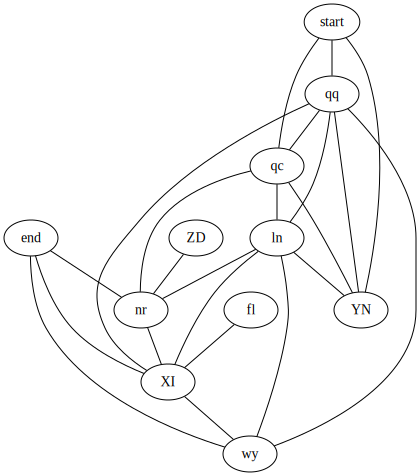

# Advent of Code 2021

My Rust solutions and thoughts regarding Advent of Code 2021.
I am *not* attempting to compete for any leaderboards, just doing these for fun and to try out crates I haven't gotten around to using (enough).
So far these include:

- [`thiserror`](https://github.com/dtolnay/thiserror)
- [`array-init`](https://github.com/Manishearth/array-init)
- [`bitvec`](https://github.com/bitvecto-rs/bitvec)
- [`ndarray-linalg`](https://github.com/rust-ndarray/ndarray-linalg/)
- [`ndarray-stats`](https://github.com/rust-ndarray/ndarray-stats)
- [`chumsky`](https://github.com/zesterer/chumsky/)
- [`petgraph`](https://github.com/petgraph/petgraph)

## Day 1

Day 1 is pretty straightforward, however, there is a fun, not immediately obvious way to improve the second part.
In digital signal processing, computing a moving average in fixed point is often optimized by only adding the newest value to the running sum and subtracting the removed value.
Essentially, this is a lossless integrator (normally unstable), followed by a comb filter.
However, as soon as you realize this, it becomes clear that if you are comparing consecutive windows and the update is `sum += new - old` you can just compare `new` and `old` directly, without computing the sum at all.

## Day 2

Nothing particularly interesting here.
Meh.

## Day 3

Straightforward, but you can play around with bit twiddling hacks.
And by partitioning the input instead of really changing the vector size you can avoid all allocations except those required during file reading.

## Day 4

Another boring one.

## Day 5

Fairly straightforward, but I decided to go for more standard loops here instead of trying to do everything with iterators, including using `BufRead::read_line` instead of `BufRead::lines` for input.
This one would have been more interesting if step two had required angles other than 45° (requiring something like [Bresenham's line algorithm](https://en.wikipedia.org/wiki/Bresenham%27s_line_algorithm)).

## Day 6

This is the first one where the straightforward solution doesn't work for step two.
Also, [my initial step two solution](https://github.com/l0calh05t/advent-of-code-2021/blob/f694b9b13cfc00bbce58ffd09542bc645a7af981/day-06/src/main.rs) allowed me to channel my inner Sean Parent and exclaim [“That’s a rotate!”](https://www.youtube.com/watch?v=UZmeDQL4LaE)
But since everything worth doing is worth overdoing:
You can reduce the complexity from O(*n*) to O(log *n*) by converting the iteration to a 9×9 iteration matrix and using [exponentiation by squaring](https://electric-snow.net/2016/05/31/fibonacci-youre-also-doing-it-wrong/).
Or take it even further and diagonalize the matrix and compute the matrix power in O(1) as Re{P D⁸⁰ P⁻¹}, which is what I did for this one (which also gave me an excuse to try [`ndarray-linalg`](https://github.com/rust-ndarray/ndarray-linalg/)).

DISCLAIMER: Don't expect this solution to be any faster.
Quite the opposite, since *n* = 256 isn't exactly a large number.

## Day 7

The simple solution of just iterating over [min, max] works just fine, but like Day 1, there is a neater solution, albeit for part one this time.
Part one is essentially asking to minimize the *L*₁ norm deviation, which can be done by just computing the median (in *n*-D space this generalizes to the [geometric median](https://en.wikipedia.org/wiki/Geometric_median))!
For part two, I just went with the direct solution, although I did optimize fuel cost function by applying the knowledge that the described numbers are simply the [triangular numbers](https://en.wikipedia.org/wiki/Triangular_number) which can be computed as *k*(*k* + 1)/2 (and actually happen to have been a topic in [my dissertation](https://tuprints.ulb.tu-darmstadt.de/11291/), albeit their *n*-D generalization).

## Day 8

Classic deductive logic puzzle.
The only interesting thing I did was to use `include_str!` to embed the input this time.
Currently, not cleaned up at all.
Plenty of magic `bitvec` constants (i.e., magic numbers).
Ideas how to make this nicer are welcome.

## Day 9

I liked this one, because it's graphics-related, and I got to use `ndarray` more.
Part one is similar to [convolution](https://en.wikipedia.org/wiki/Convolution) and can be implemented via 2D windowed iteration with padding to get the borders.
Part two is essentially a [flood fill](https://en.wikipedia.org/wiki/Flood_fill) with a custom filling condition.

## Day 10

Oooh… a parsing task!
Finally, a reason to try some of those parser combinator crates I've been eying 👀!
But [which](https://lib.rs/crates/chumsky) [to](https://lib.rs/crates/pom) [choose](https://lib.rs/crates/nom)?
I decided to try `chumsky` for this one, and was pretty happy with the result for part one, except for the fact that `chumsky`'s error type doesn't appear to implement `std::error::Error` (so no `color-eyre` this time).
Had the parser set up in a matter of minutes, and the error output already included all I needed.
For part two, I tried (and failed) to use `chumsky`'s error recovery mechanisms, but maybe I just used it incorrectly.
In the end, I just used the `expected` part of the error and appended the closing option to a mutable string buffer until everything parsed just fine.
~~Almost~~ certainly not the most efficient solution, but easily fast enough (far below a second to parse every line *at least* three times).
I was generally pretty impressed with `chumsky`'s speed.

### Addendum

Added some basic timing code.
Part one takes roughly 5 ms and part two 54 ms.
And that's for the O(*n*²) in recovery length approach I used!
Because I can, I also added an `u8`-based direct parser with an explicit stack which completes both tasks in 65 **μs** (270–300 μs when printing is included).
ASCII go brrrrr.

## Day 11

This one was pretty straightforward.

## Day 12

We have reached the 50% point.
Another pretty straightforward one.
Since this one was based on a graph, I decided to try `petgraph`.
One neat feature is GraphViz `.dot` output, although it doesn't work if the edges don't have weights, even if `Config::EdgeNoLabel` is specified:

## Day 13

Since the input field isn't that big, this could have been done using dense arrays.
But since most fields would be zero anyway and working with sparse representations is [kind of my thing](https://tuprints.ulb.tu-darmstadt.de/11291/), I chose to use a coordinate representation.

## Day 14

Finally, another one where the straightforward solution doesn't work for part two due to exponential growth!
The solution that works is fairly similar to my initial Day 6 solution in that I only work on element pair counts, since we don't really care where element are inserted only how many.
The first and last element need to be treated specially during counting, as they are the only ones that aren't counted twice.

## Day 15

A classic shortest path problem calling for [Dijkstra's algorithm](https://en.wikipedia.org/wiki/Dijkstra%27s_algorithm) or the more efficient [A* algorithm](https://en.wikipedia.org/wiki/A*_search_algorithm).
Since every step costs at least one, the conservative heuristic, i.e., the one that guarantees a correct result, is just the *L*₁ distance.
Since `petgraph` already provides both algorithms, I decided to just use that.
Instead of converting my number array into `petgraph`'s standard `Graph` data structure, I decided to implement the required traits on a newtype wrapper around `ndarray::Array2<u8>`.
Far more work than anticipated and really made me wish for [associated `impl Trait` types](https://github.com/rust-lang/rust/issues/63063), but I can't complain about the result.
Alternatively, I could also have used boxed iterator trait objects and hoped that the optimizer solves any performance issues, but at that point, why not just use `Graph`?

## Day 16

Pro tip: read the specification and the documentation first.
Why do I say this?
Because I didn't heed my own advice and decided to try doing this with `chumsky`, since it was another parsing task.
That approach worked fine for the value packets, but due to the context dependence in the operator packets (and [`chumsky` doesn't support nested parsers yet](https://github.com/zesterer/chumsky/issues/50)) it wasn't suitable for those packets.
So another custom parser, so what.
